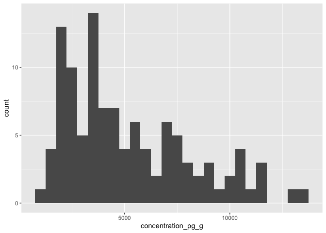
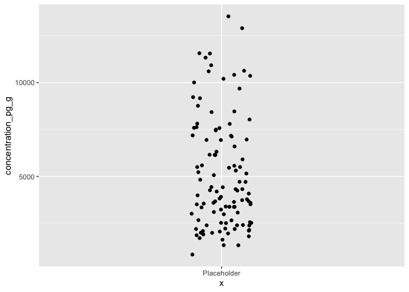
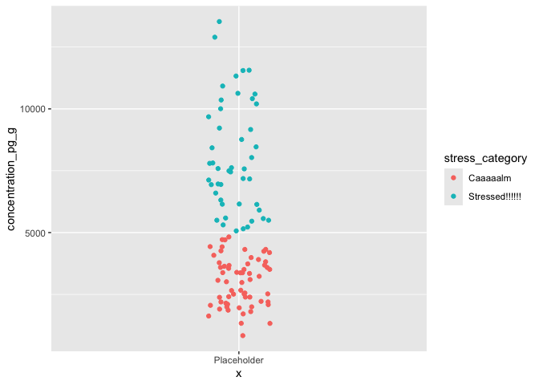

Activity 8: Computational thinking 2: conditionals
================

# Overview

Welcome! This is the second “computational thinking” lesson, which
continues work on for loops and revisits conditional statements.

------------------------------------------------------------------------

You will submit one output for this activity:

1.  A **PDF** of a rendered Quarto document with all of your R code.
    Please create a new Quarto document (e.g. don’t use this
    `README.qmd`), include all of the code that appears in this
    document, in addition to adding your own code and **answers to all
    of the questions** in the “Q#” sections. Submit this through
    Gradescope.

*If you have trouble submitting as a PDF, please ask Calvin or Malin for
help. If we still can’t solve it, you can submit the .qmd file instead.*

A reminder: **Please label the code** in your final submission in two
ways: 1) denote your answers to each question using headers that
correspond to the question you’re answering and 2) thoroughly “comment”
your code: remember, this means annotating your code directly by typing
descriptions of what each line does after a `#`. This will help future
you!

------------------------------------------------------------------------

Let’s start by reading in the relevant packages

``` r
library(tidyverse)
library(here)
```

------------------------------------------------------------------------

# 1. Conditionals

We’ve already worked with conditionals during one of the seaside chats,
which used `case_when()`, `dplyr's` version of an `if_else` statement.
Today we’ll walk through using `if_else` statements, the precursor to
`case_when()`, as well as get more practice with `case_when()`.

## 1.1 if else statements

`if else` statements take the form of:

``` default
if (condition){
  code to execute if condition is TRUE
} else {
  code to execute if condition is FALSE
}
```

For example, below we define x as 5, then write a statement that checks
whether or not a statement, `x > 10`, is TRUE. If it’s true, it will
print out the first part. If not, it will print the second.

``` r
x <- 5
 
# Check value is less than or greater than 10 
if(x > 10)
{ 
    print(paste(x, "is greater than 10")) 
} else
{ 
    print(paste(x, "is less than or equal to 10")) 
}
```

    [1] "5 is less than or equal to 10"

### Q1.1: Modify the value of x

Copy/paste this example by change x to be 11. What is the output of the
if else statement?

``` r
x <- 11
 
# Check if the value of x is less than or equal OR greater than 10 
if(x > 10)
{ 
    print(paste(x, "is greater than 10")) 
} else
{ 
    print(paste(x, "is less than or equal to 10")) 
}
```

    [1] "11 is greater than 10"

------------------------------------------------------------------------

### Using `traceback()` for errors

There are many ways to get help with errors in R. The `traceback()`
function is one, and it prints out a summary of how your code arrived at
the error you received.

Let’s revisit this if else statement:

``` r
x <- 5
 
# Check value is less than or greater than 10 
if(x > 10)
{ 
    print(paste(x, "is greater than 10")) 
} else
{ 
    print(paste(x, "is less than or equal to 10")) 
}
```

    [1] "5 is less than or equal to 10"

Let’s change the `x <- 5` to `x <- "five"`. Run this code, which
attempts to do math on a character string, and immediately run
`traceback()` afterwards.

``` r
x <- "five"
 
# Check if the value of x is less than or equal OR greater than 10 
if(x > 10)
{ 
    print(x*2) 
} else
{ 
    print(x/2) 
}
```

``` r
traceback()
```

    No traceback available 

In this example, `traceback()` is telling you basically everything that
the error code is, but it adds “at \#3”, meaning at line \#3. This can
be particularly helpful if you are running a big function, loop, series
of functions, etc, and need to figure out exactly when and where that
pesky error started.

You can read more about debugging and the `traceback()` function in
particular at this link: <https://adv-r.hadley.nz/debugging.html>
(`traceback()` in section 22.3)

------------------------------------------------------------------------

### Adding another condition

Let’s make it a little more complex by adding a third conditional. The
if else statements in R can be nested together to form multiple
statements and will evaluate expressions based on the conditions one by
one, beginning from the outer condition to the inner one.

Here, we will make R print one thing if x is less than 10, something
else if x is equal to 10, and a third thing if x is greater than 10.

``` r
# define a variable
x <- 10

# check the value of x using nested if-else statements
if (x < 10) {
  # if x is less than 10
  print("x is less than 10")
} else {
  # if x is exactly equal to 10
  if (x == 10) {
    # if x equals 10
    print("x is 10!!!")
  } else {
    # if x is greater than 10
    print("x is greater than 10")
  }
}
```

    [1] "x is 10!!!"

Run the statement above with `x = 9`, `x = 10`, and `x = 11` to see what
happens.

------------------------------------------------------------------------

Let’s combine what we learned about for loops with an if else statement.
The goal here is to take a vector of numbers, loop through it, and apply
our if else statement to each element in the vector, telling us if it’s
less than, equal to, or greater than 10.

First define a vector to loop through:

``` r
vec <- c(10, 11, 9, 10)
```

Then we start the for loop:

``` r
# For 1 through the length of the vector "vec" 
for (i in 1:length(vec)) {
  
# check the value of using nested if-else statements
if (vec[i] < 10) {
  # if the element is less than 10
  print("value is less than 10")
} else {
  # if the element is exactly equal to 10
  if (vec[i] == 10) {
    # if the element equals 10
    print("value is 10!!!")
  } else {
    # if the element is greater than 10
    print("value is greater than 10")
  }
}

}
```

    [1] "value is 10!!!"
    [1] "value is greater than 10"
    [1] "value is less than 10"
    [1] "value is 10!!!"

The for loops iterates through the vector and applies the if else
statement separately for each vector element, printing an output for
each vector element.

### Q1.2: Create a new for loop + if else statement

Remake a similar for loop / if else statement as above. The for loop
should loop through a vector called `y` that has the values
`-2, 42, 0, 10` and should assess whether or not the values are
negative, positive, or equal to zero. First define a vector to loop
through:

``` r
# Define the vector
y <- c(-2, 42, 0, 10)

# For 1 through the length of the vector "y"
for (i in 1:length(y)) {
  
# check the value of using nested if-else statements
if (y[i] < 0) {
  # if the element is less than 0
  print("value is less than 0")
} else {
  # if the element is exactly equal to 0
  if (y[i] == 0) {
    # if the element equals 0
    print("value is 0!!!")
  } else {
    # if the element is greater than 0
    print("value is greater than 0")
  }
}

}
```

    [1] "value is less than 0"
    [1] "value is greater than 0"
    [1] "value is 0!!!"
    [1] "value is greater than 0"

------------------------------------------------------------------------

------------------------------------------------------------------------

## 1.2 `case_when()` and pikas

Let’s return to the `tidyverse` and revisit `case_when()`, `dplyr`’s
version of the if else statement. We will work with the
`lterdatasampler` data again, so let’s load in those two packages:

``` r
library(lterdatasampler)
library(tidyverse)
```


Today we will work with the pika data, `nwt_pikas`! From the vignette on
the `lterdatasampler` package:

“*Researchers at the Niwot Ridge Long Term Ecological Research Site (NWT
LTER) seek to study and monitor the health of the Colorado Rockies over
time. Because of external factors like climate change, it’s more
important than ever for scientists to understand how and why the Rockies
are changing.*”

“*The American pika (*Ochotona princeps*) is a key species present at
the NWT LTER. Despite their small size, pikas can be very informative
about the health of the ecosystem. If pikas are more stressed, it can
suggest that their habitat has declined in quality. As a result, the
study of pikas is critical to the Colorado Rockies ecosystem.*” Also,
these study sites are very close to where Calvin grew up :)

------------------------------------------------------------------------

### Q1.3: How do the researchers measure pika stress?

Navigate to the help page of this dataset. In a couple sentences,
describe how the researchers measured pika stress.

------------------------------------------------------------------------

### Q1.4: What does a row represent in this data?

What does a row represent in this dataset? Is it an average value from a
site? From a station? From an individual pika? From an individual pika
poop? From a subsample of a pika poop?

------------------------------------------------------------------------

### Categorize stress

The researchers measured concentration on a continuous scale in the
`concentration_pg_g` column. For `case_when()` practice, let’s turn this
into a categorical scale by assigning an arbitrary (warning: this is not
endorsed by Pika Science) threshold after which we call a pika
“stressed”.

First let’s look at a distribution of the values in the
`concentration_pg_g` column to see if there are any natural breakpoints:

``` r
# Make a histogram
nwt_pikas %>% 
  ggplot(aes(x = concentration_pg_g)) +
  # Add the histogram geom, which only needs an x-axis
  # Choose a binwidth of 500 picogram GCM/gram
  geom_histogram(binwidth = 500)
```



``` r
# Make a scatterplot with jittered points
nwt_pikas %>% 
  # We're adding a little placeholder axis just so we can see the point distribution
  ggplot(aes(x ="Placeholder", 
             y = concentration_pg_g)) +
  # Add the geom_jitter geom
  geom_jitter(width = 0.1)
```



It looks like a lot of the data points are before 5000 or 6000. Let’s
arbitrarily choose 5000 as the threshold after which pikas become
stressed.

let’s create a new column with a `mutate` and a `case_when`. Let’s call
the new column stress_category and have it equal “Stressed!!!!!!” when
the `concentration_pg_g` column is greater than 5000, and “Caaaaalm”
when it’s less than or equal to that value.

``` r
nwt_pikas_categ <- nwt_pikas %>% 
  mutate(stress_category = case_when(
    concentration_pg_g > 5000 ~ "Stressed!!!!!!",
    .default = "Caaaaalm"
  ))

# Check out the first 6 rows
head(nwt_pikas_categ)
```

    # A tibble: 6 × 9
      date       site      station utm_easting utm_northing sex   concentration_pg_g
      <date>     <fct>     <fct>         <dbl>        <dbl> <fct>              <dbl>
    1 2018-06-08 Cable Ga… Cable …      451373      4432963 male              11563.
    2 2018-06-08 Cable Ga… Cable …      451411      4432985 male              10629.
    3 2018-06-08 Cable Ga… Cable …      451462      4432991 male              10924.
    4 2018-06-13 West Kno… West K…      449317      4434093 male              10414.
    5 2018-06-13 West Kno… West K…      449342      4434141 male              13531.
    6 2018-06-13 West Kno… West K…      449323      4434273 <NA>               7799.
    # ℹ 2 more variables: elev_m <dbl>, stress_category <chr>

### Q1.5: Remake the scatterplot, but color the points by the new stress category

Remake our scatterplot from above, but this time color the points by the
new category we just made.

``` r
# Make a scatterplot with jittered points
nwt_pikas_categ %>% 
  # We're adding a little placeholder axis just so we can see the point distribution
  ggplot(aes(x ="Placeholder", 
             y = concentration_pg_g,
             color = stress_category)) +
  # Add the geom_jitter geom
  geom_jitter(width = 0.1)
```



Hopefully you can now visualize what that `case_when()` statement did
with the information we gave it.

Let’s

``` r
nwt_pikas_categ$date %>% unique()
```

     [1] "2018-06-08" "2018-06-13" "2018-06-21" "2018-06-25" "2018-06-29"
     [6] "2018-07-11" "2018-07-20" "2018-07-31" "2018-08-01" "2018-08-02"
    [11] "2018-08-09" "2018-08-20" "2018-09-04"

------------------------------------------------------------------------

# 2. Getting help in R

Early in your R journey you will likely have errors in your R code more
often than not, so knowing how to deal with code that doesn’t work as
you expect is a key part of learning. You have already been asked in
past lessons to deal with this, by identifying error messages, accessing
help pages, and going online to .

------------------------------------------------------------------------

## 2.1 Help pages

------------------------------------------------------------------------

## 2.2 Stack overflow

------------------------------------------------------------------------

## 2.3 Traceback()?

------------------------------------------------------------------------

## 2.4 LLMs

------------------------------------------------------------------------
